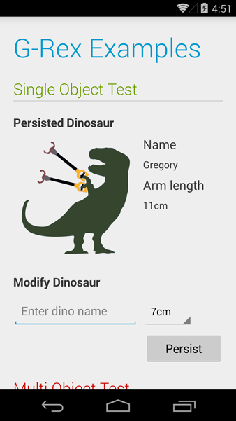

G-Rex
=====

A tiny library that assists in saving and restoring objects to disk using Gson and RxJava on Android.



Details
-------

There are [many options][1] for persisting data in Android, some easier than others.

* Simple key/value pair? [SharedPreferences][2] makes that simple.
* Elaborate and enormous data sets? [SQLite][3] can help you, if that's your kind of thing...
* Everything else? We just want to put and get objects from disk with minimal overhead.

G-Rex is here to help. It's not doing anything fancy, it's probably code you've many times yourself. It just wants to help you with a task that can be tedious, allowing you to get on coding the fun stuff.

G-Rex is most useful to those already using [Gson][4] and [RxJava][5] in their applications. Gson allows for simple serialization/deserialization of objects. RxJava helps alleviate threading concerns and allows for composition with exists method chains.

Usage
-----

Say we have a class called `Dino`

```java
public class Dino {
	public String name;
	public int armLength;
}
```

You can use a `GRexPersister` as a stand alone helper to store a Dino.

```java
GRexPersister persister = new GRexPersister(getContext(), "persistence");

Dino dino = new Dino("Gregory", 37);

persister.put("dinoKey", dino)
	.subscribeOn(Schedulers.io())
	.observeOn(AndroidSchedulers.mainThread())
	.subscribe(new Observer<Dino>() {
		@Override
		public void onNext(Dino dino) {
			//Hurrah, dino was persisted!
		}
	});
```

If you're an rxjava-android user, this code will look very familiar to you. The write operation will occur off the main thread, and we get informed of the completion back *on* the main thread.

You could also store a List of toothy friends
```java
List<Dino> dinos = getDinoList(); //Some method that returns an ArrayList of Dinos.

persister.putList("dinoListKey", Dino.class)
	.subscribeOn(Schedulers.io())
	.observeOn(AndroidSchedulers.mainThead())
	.subscribe(new Observer<List<Dino>>() {
		@Override
		public void onNext(List<Dino> dinos) {
			//Fear the stubby-armed army
		} 
	});
```

Are you using RxJava in conjunction with Square's [Retrofit][6]? You could download and persist data in one go.

```java
webServices.getDino()
    .flatMap(new Func1<Dino, Observable<Dino>>() {
        @Override
        public Observable<Dino> call(Dino dino) {
            return persister.put("dinoKey", dino`);
        }
    })
    .subscribeOn(Schedulers.io())
    .observeOn(AndroidSchedulers.mainThread())
    .subscribe(new Observer<Dino>() {
        @Override
        public void onNext(Dino dino) {
            //Behold the downloaded and persisted dino
        }
    });

```

Download
--------

TODO: Include jar and Gradle link after push to Maven Central

License
--------

    Copyright 2014 GRIDSTONE

    Licensed under the Apache License, Version 2.0 (the "License");
    you may not use this file except in compliance with the License.
    You may obtain a copy of the License at

       http://www.apache.org/licenses/LICENSE-2.0

    Unless required by applicable law or agreed to in writing, software
    distributed under the License is distributed on an "AS IS" BASIS,
    WITHOUT WARRANTIES OR CONDITIONS OF ANY KIND, either express or implied.
    See the License for the specific language governing permissions and
    limitations under the License.

 [1]: http://developer.android.com/guide/topics/data/data-storage.html
 [2]: http://developer.android.com/reference/android/content/SharedPreferences.html
 [3]: http://developer.android.com/reference/android/database/sqlite/SQLiteOpenHelper.html
 [4]: https://code.google.com/p/google-gson/
 [5]: https://github.com/ReactiveX/RxJava
 [6]: http://square.github.io/retrofit/